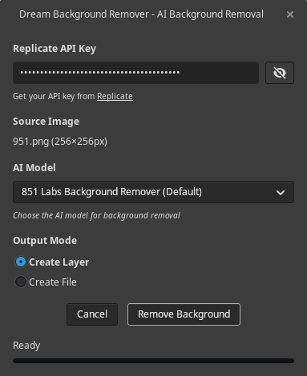

# Dream Background Remover - GIMP Plugin

Dream Background Remover brings Replicate's AI capabilities directly into GIMP for intelligent background removal.



## Features

- 🎨 **AI Background Removal**: Remove backgrounds from your images
- 🔄 **Smart Layer Management**: Automatically creates properly named layers
- 🌍 **Multi-Language Support**: Setup to support multiple languages via i18n
- 🏗️ **Native GIMP Integration**: Works seamlessly within your GIMP workflow

## Installation

### Prerequisites

- **GIMP 3.0.x**
- **Python 3.8+**
- **Replicate API key** (paid account required)

Install the required Python library:

```bash
pip install replicate
```

### Quick Install

1. **Download the latest release** from [GitHub Releases](https://github.com/zquestz/dream-background-remover/releases)

2. **Extract the release**

   This will create a folder named `dream-background-remover-{version}` (e.g., `dream-background-remover-1.0.0`)

3. **Move to your GIMP plugins folder with the correct name:**

   Rename and move the extracted folder to exactly `dream-background-remover` in your GIMP plugins directory:
   - **Linux**: `~/.config/GIMP/3.0/plug-ins/dream-background-remover/`
   - **Windows**: `%APPDATA%\GIMP\3.0\plug-ins\dream-background-remover\`
   - **macOS**: `~/Library/Application Support/GIMP/3.0/plug-ins/dream-background-remover/`

   Example for Linux:

   ```bash
   # Extract creates dream-background-remover-1.0.0/
   unzip dream-background-remover-1.0.0.zip
   # Move to correct location with correct name
   mv dream-background-remover-1.0.0 ~/.config/GIMP/3.0/plug-ins/dream-background-remover
   ```

4. **Make executable** (Linux/macOS only):

   ```bash
   chmod +x ~/.config/GIMP/3.0/plug-ins/dream-background-remover/dream-background-remover.py
   ```

5. **Restart GIMP**

**Building translations (optional):** If you need languages other than English, run `python3 scripts/build-translations.py` in the plugin directory after installation.

### Arch Linux Installation

To install Dream Background Remover on Arch Linux, you can install it from the AUR.

```bash
yay -S dream-background-remover
```

### Advanced Installation

#### Manual Installation from Source

1. **Find your GIMP plugins directory** (paths listed above)

2. **Create plugin directory:**

   ```bash
   mkdir -p ~/.config/GIMP/3.0/plug-ins/dream-background-remover/
   ```

3. **Copy all Python files:**

   ```bash
   cp *.py ~/.config/GIMP/3.0/plug-ins/dream-background-remover/
   ```

4. **Build and install translations (Optional):**

   ```bash
   python3 scripts/build-translations.py
   cp -r locale ~/.config/GIMP/3.0/plug-ins/dream-background-remover/
   ```

5. **Make executable:**
   ```bash
   chmod +x ~/.config/GIMP/3.0/plug-ins/dream-background-remover/dream-background-remover.py
   ```

#### Development Setup

```bash
git clone https://github.com/zquestz/dream-background-remover.git
cd dream-v
pip install replicate
python3 scripts/build-translations.py # optional, defaults to English
ln -s $(pwd) ~/.config/GIMP/3.0/plug-ins/dream-background-remover
```

### Python Dependencies Note

**Important**: Use the same Python that GIMP uses. If `pip install replicate` doesn't work:

```bash
# System-wide installation
sudo pip install replicate

# User installation (recommended)
pip install --user replicate

# Ensure Python 3
pip3 install replicate
```

#### macOS Instructions

If you get the **"replicate not installed"** error on macOS:

1. **Locate GIMP's Python** by opening the Python Console: `Filters → Development → Python-Fu`
2. **Run this command** in the console:

   ```python
   import sys; print(sys.executable)
   ```

   You should see something like:

   ```
   /Applications/GIMP.app/Contents/MacOS/python3
   ```

3. **Install replicate using GIMP's Python** from Terminal:

   ```bash
   # Change to GIMP's Python directory
   cd /Applications/GIMP.app/Contents/MacOS

   # Ensure pip is installed
   ./python3 -m ensurepip

   # Install replicate
   ./python3 -m pip install replicate
   ```

## Getting Your API Key

1. **Visit [Replicate](https://replicate.com/)**
2. **Generate an API key**
3. **Keep your key secure and monitor usage/costs**

### API Specifications

- **Model**: `851-labs/background-remover`

### Cost Considerations

- Each image generation/edit counts toward your API usage
- Monitor your usage at [Replicate](https://replicate.com/) to avoid unexpected charges

## Usage

### Basic Workflow

1. **Open an image in GIMP**
2. **Launch Dream Background Remover**: `Filters → AI → Dream Background Remover...`
3. **Enter your API key** (saved automatically for future use)
4. **Select mode**:
   - **Create Layer**: Creates a layer in your current image with the background removed
   - **Create File**: Create a new image with your background removed
5. **Generate**: Click the generate button and watch the progress
6. **Result**: New layer or file appears with the background removed

## Language Support

### Available Languages

Dream Background Remover is fully translated and available in:

- **🇺🇸 English** (default)
- **🇪🇸 Spanish** (complete)
- **🇫🇷 French** (complete)
- **🇵🇹 Portuguese** (complete)
- **🇷🇺 Russian** (complete)
- **🇯🇵 Japanese** (complete)
- **🇮🇳 Hindi** (complete)
- **🇧🇩 Bengali** (complete)
- **🇨🇳 Chinese (Simplified)** (complete)
- **🇹🇼 Chinese (Traditional)** (complete)
- **🇰🇷 Korean** (complete)

The plugin automatically detects your system language and uses the appropriate translation. If your language isn't available, it defaults to English.

### For Developers

```bash
# Extract new translatable strings
python3 scripts/update-pot.py

# Update existing translations
python3 scripts/update-translations.py

# Build compiled translations
python3 scripts/build-translations.py
```

## Architecture

The plugin is organized into focused modules:

- **`dream-background-remover.py`** - Main GIMP plugin entry point
- **`dialog_gtk.py`** - GTK user interface components
- **`dialog_events.py`** - Event handling and user interactions
- **`dialog_threads.py`** - Background processing and threading
- **`api.py`** - Replicate API integration
- **`integrator.py`** - GIMP-specific operations
- **`settings.py`** - Configuration persistence
- **`i18n.py`** - Internationalization support

## Troubleshooting

### Common Issues

**"replicate not installed" warning**

- Install with: `pip install replicate`
- Ensure you're using GIMP's Python environment

**Plugin doesn't appear in menu**

- Check file permissions: `chmod +x dream-background-remover.py`
- Restart GIMP after installation
- Verify files are in correct plugins directory

**API errors**

- Verify your API key is correct
- Check your quota at [Replicate](https://replicate.com/)
- Monitor costs to avoid unexpected charges

**Interface problems**

- Check GIMP's Error Console: `Windows → Dockable Dialogs → Error Console`
- Ensure translations are built: `python3 scripts/build-translations.py`
- Report UI issues with screenshots

### Getting Help

1. **Check the Error Console** in GIMP for specific error messages
2. **Verify all requirements** are installed correctly
3. **Check file permissions** on the plugin directory
4. **Review API quotas** if getting timeout errors

## Contributing

### For Translators

We welcome translations! Here's how to contribute:

1. **Copy the template**: `cp locale/dream-background-remover.pot locale/[YOUR_LANG].po`
2. **Translate the strings** using Poedit, Lokalize, or any text editor
3. **Test your translation**: Build with `python3 scripts/build-translations.py`
4. **Submit a pull request** with your `.po` file

**Translation Guidelines:**

- Keep UI text concise but clear
- Use GIMP's existing terminology for your language
- Preserve HTML tags and placeholders like `{count}`, `{url}`
- Test that text fits in the interface

### For Developers

1. **Fork the repository**
2. **Create a feature branch**
3. **Follow the existing code style**
4. **Update translations** if adding new strings
5. **Submit a pull request**

## License

This project is licensed under the MIT License - see the [LICENSE](LICENSE) file for details.

## Credits

Built with the Replicate API.
